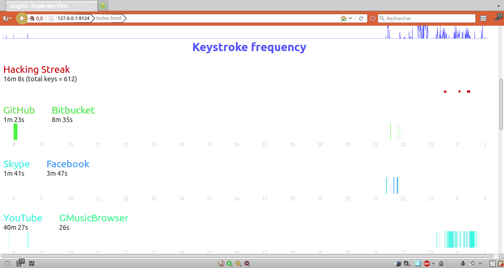
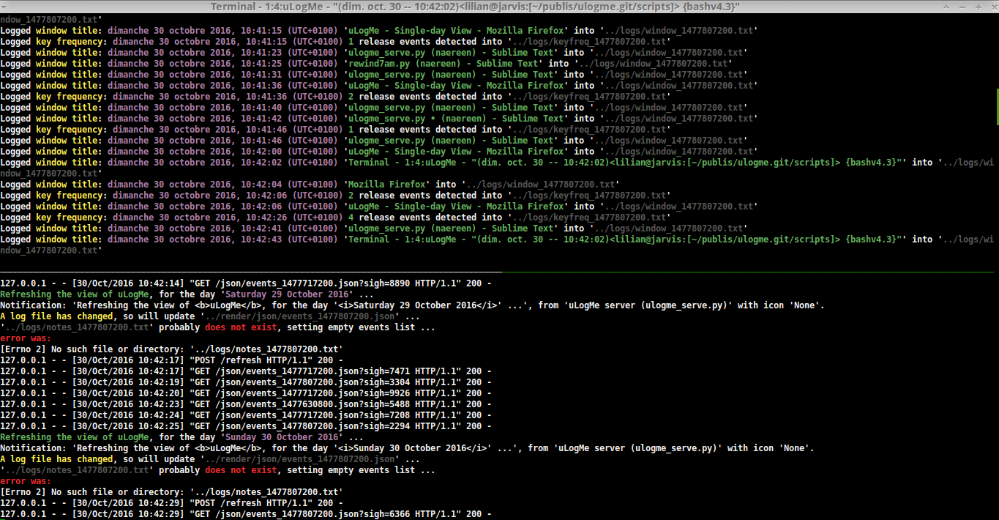

# **uLogMe**

> ### How productive were you today? How much code have you written? Where did your time go?

Keep track of your computer activity throughout the day: visualize your active window titles and the number and frequency of keystrokes, in beautiful and responsive HTML timelines.

Current features:

- Records your **active window** title throughout the day
- Records the **frequency of key presses** throughout the day (but not the actual key: no security threat)
- Record custom **note annotations** for particular times of day, or for day in general
- Everything runs **completely locally**: *none* of your data is uploaded anywhere
- **Beautiful, customizable UI** in HTML/CSS/JS (using [d3js](https://www.d3js.org/)).

The project currently **only works on Ubuntu** or Debian-like Linux (for an OSX version, see [the original project](https://github.com/karpathy/ulogme)).
It uses the new fancy [`Promises`](https://developer.mozilla.org/en-US/docs/Web/JavaScript/Reference/Global_Objects/Promise) feature of ECMAScript 6. This might not be implemented in all browsers, but recent one should have it (recent Chrome and Firefox are fine, at least).

## Screenshots
### "Daily view" page

### "Overview" page

## Demo (by [@karpathy](https://github.com/karpathy))
See a blog post (along with multiple screenshots) describing the project [here.](http://karpathy.github.io/2014/08/03/quantifying-productivity/)

----

## Getting started

**To start recording**

1. Clone the repository to some folder: `$ git clone https://github.com/Naereen/uLogMe.git`
2. If you're on Ubuntu, make sure you have the dependencies: the `xdotool` `xinput` `wmctrl` `xprintidle` packets are *required* (to install them: `$ sudo apt-get install xdotool xinput wmctrl xprintidle`). On other Linux distribution, install them also, and you may also need gnome-screensaver (`$ sudo PACKETMANAGER install gnome-screensaver` where `PACKETMANAGER=pacman` on ArchLinux, `PACKETMANAGER=yum` on Fedora, etc).
3. `cd` inside and run `$ ./ulogme.sh`. This will launch two scripts. The first one, [`keyfreq.sh`](scripts/keyfreq.sh), records the frequency of keystrokes, and the other one ,[`logactivewin`](scripts/logactivewin.sh), records active window titles. Both write their logs into log files in the `logs/` directory. Every log file is very simple: just the [Unix time stamp](https://en.wikipedia.org/wiki/Unix_time) followed by data, one per line (plain text file). We tried to be smart and only logging the useful data.

**The user interface**

1. **Important**. As *a one-time setup*, copy over [the example settings file](render/js/render_settings_example.js) to your own copy: `$ cp render/js/render_settings_example.js render/js/render_settings.js` to create your own `render_settings.js` settings file. In this file modify everything to your own preferences. Follow the provided example to specify title mappings: A raw window title comes in, and we match it against regular expressions to determine what type of activity it is. For example, the code would convert "Google Chrome - some cool website" into just "Chrome", or "GitHub - Mozilla Firefox" into just "GitHub". Follow [the provided example](render/js/render_settings_example.js) and read the comments for all settings in the file.
2. Once that is set up, start the web server viewer: `$ python ulogme_serve.py`, and go to [the provided address](http://localhost:8124) (by default, it is `http://localhost:8124`) in your browser. Hit the refresh button on top right every time you would like to refresh the results based on most recently recorded activity (it erases cache). You can also use a convenience file [`ulogme_serve.sh`](scripts/ulogme_serve.sh) to do both: start the server, and open the web-page.
3. If your data is not loading, try to explicitly run `$ python export_events.py` and then hit refresh. This could only be an issue the very first time you run uLogMe.

Bonus: **If you are using [tmux](https://tmux.github.io/)**

1. The script `ulogme_tmux.sh` can be used to create a new tab in your current [tmux](https://tmux.github.io/) session, name it "uLogMe", split it in half vertically, and then it starts the user interface script in the left column, and the data recording in the right column. Very convenient!

Hum... **What is [tmux](https://tmux.github.io/)?**

1. The best terminal multiplexer. Just go [discover more by yourself](https://tmux.github.io/) (by @tmux).

----

## User Interface
The user interface can switch between a [single day view](render/index.html) and an [overview view](render/overview.html) by link on top. You have to hit the refresh button every time you'd like to pull in new data (and not your browser's refresh, Ctrl-R or F5, as it reads the cache by default).

#### Single day page
- You can enter a reminder "blog" on top if you'd like to summarize the day for yourself or enter other memos.
- Click on any bar in the *barcode view* to enter a custom (short) note snippet for the time when the selected activity began. I use this to mark meetings, track my coffee/food intake, sleep time, or my total time spent running/swimming/gym or to leave notes for certain patterns of activity, etc. These could all later be correlated with various measures of productivity, in future.
- Note: [every chart title has a permanent anchor linked to it](https://raw.githubusercontent.com/Naereen/uLogMe/master/screenshots/anchors_on_every_chart_titles.png).

#### Overview page
- You can click the window titles to toggle them on and off from the visualization.
- Clicking on the vertical bars takes you to the full statistics for that day.

#### Keyboard shortcuts
- On both pages, <kbd>r</kbd> reloads the data (like clicking the reload ⟲ button).
- On the single day page, <kbd>left</kbd> or <kbd>p</kbd> goes to the *previous* day, <kbd>right</kbd> or <kbd>r</kbd> goes to the *next* day.
- Go to overview page with <kbd>o</kbd> and to the single day page (to the more recent day) with <kbd>s</kbd> or <kbd>i</kbd>.

----

## Interactive demo

----

## Security concerns ?
Your private data should be safe with uLogMe:

- *Your data don't leave your computer!* (you can read the code in details to check it).
- Only the number of keys hit is logged, not the details of *which* keys were hit (during time windows of 10 seconds).
- You can safely *delete any data*, any time (see below), without risking to break the program.
- For the window titles, *warning* by default every title is logged. You can add more checks in the [logactivewin.sh](scripts/logactivewin.sh) script (`XXX customize here...`). Right now, the title is not logged if it contains one of these words: `privée`, `InPrivate`, `Private`, `Incognito` (it should be enough to remove private browsing windows from Firefox, Chrom{e,ium}, and Internet Explorer).

> Of course, this is a computer program, written by enthusiast programmers, not security experts: there is bugs, and there might be security problems. But none that we know of at least!
> [Please file an issue if you notice a potential security threats](https://GitHub.com/Naereen/uLogMe/issues/new) !

### *How can I clean my data ?*
- Simply delete the `logs/` folder to completely remove your old data.
- You can aslo delete the log file for just one day if you want (e.g., if you are ashamed of a very non-productive day haha!).

----

## :bug: Known issues
- You may see *"The port 8124 was already used"* error if you try to run `python ulogme_serve.py`. This may be because the port is being used by another program. You can use the optional argument to specify a different port, for example `$ python ulogme_serve.py 8125` and then go to `http://localhost:8125/` instead, (for example).
- Overview page is blank. Are you sure your browser supports ECMAScript 6 ? You can check it with these tools: [ES6 checker](https://ruanyf.github.io/es-checker/) or [Compat-Table ES6](https://kangax.github.io/compat-table/es6/). Any recent browser should be fine (Chrome and Firefox, at least).

----

## Explanations on the architecture
- The Ubuntu and OSX code base are a little separate on the data collection side (note: I am NOT keeping the OSX code in [my fork](https://github.com/Naereen/uLogMe/), cf. the [original project](https://github.com/karpathy/ulogme/)).
- However, they each just record very simple log files in `/logs`.
- Once the log files are written, [`export_events.py`](scripts/export_events.py) takes the log files, does some simple processing and writes the results into JSOn files (`.json`) in [`/render/json`](render/json/).
- The HTML templates for the UI lives in [`/render`](render/). It uses jQuery.Ajax to read the JSON files, and then [d3js](https://d3js.org/) for the plots and charts.
- The Javascript scripts (requirements, library and utility functions) lives in [`/render/js`](render/js/). The dependencies are included minimized, everything is © of their original authors.
- The CSS style sheets for the UI lives in [`/render/css`](render/css/). It's very basic CSS formatting.
- There is also two SVG files (for some badges) in [`/render/svg`](render/svg/), and a small [Pikachu favicon](render/favicon.ico)! *Why Pikachu?* [ALWAYS PIKACHU!](http://www.lsv.ens-cachan.fr/~picaro/). [Pikachu](scripts/pikachu.png) (and other Pokémons) should also be used for the icon for the [desktop notifications](scripts/notify.py) sent when refreshing... Useless but funny right?! Here is a demo:

### Ubuntu (or any Debian-like Linux)
uLogMe has three main parts:

1. Recording scripts [`keyfreq.sh`](scripts/keyfreq.sh) and [`logactivewin.sh`](scripts/logactivewin.sh). You probably will not touch these.
2. Webserver: [`ulogme_serve.py`](scripts/ulogme_serve.py) which wraps Python's `SimpleHTTPServer` and does some basic communication with the UI. For example, the UI can ask the server to write a note to a log file, or for a refresh. [`ulogme_serve.sh`](scripts/ulogme_serve.sh) helps to launch the Python web server more easily.
3. The UI. Majority of the codebase is here, reading the `.json` files in [`/render`](render/) and creating the visualizations. There are several common `.js` files, and crucially the [`index.html`](render/index.html) and [`overview.html`](render/overview.html) files, that are simple HTML template (with a lot of Javascript in the beginning). Feel free to adapt them to your preferences. I expect that most people might be able to contribute here to add features/cleanup/bugfix.
4. *Bonus:* the [`ulogme_tmux.sh`](scripts/ulogme_tmux.sh) script, if you are using [tmux](https://tmux.github.io/).

An example of the output displayed by the two parts of the "server" side (data recording and HTTP server), in two horizontal panes in [tmux](https://tmux.github.io/):

Yes, the logs **are colored**, from both shell and python scripts, using [`color.sh`](scripts/color.sh) for bash and [`ansicolortags`](https://github.com/Naereen/ansicolortags.py) for Python.

### OSX code
> Not in my fork, refer to [the original project](https://github.com/karpathy/ulogme)

----

## Related projects ?
- [`selfspy`](https://github.com/gurgeh/selfspy): log everything you do on the computer, for statistics, future reference and all-around fun. I also worked a little bit on [selfspy-vis](https://github.com/Naereen/selfspy-vis), some tools to visualize the data collected by [`selfspy`](https://github.com/gurgeh/selfspy).
- My minimalist dashboard, generated every hour (with [a `crontab` file](https://help.ubuntu.com/community/CronHowto)), with this bash script [`GenerateStatsMarkdown.sh`](https://bitbucket.org/lbesson/bin/src/master/GenerateStatsMarkdown.sh).

For more projects, [this question on Personal Productivity Stack Exchange](https://productivity.stackexchange.com/questions/13913/automatic-time-tracking-software-for-computer-work-for-windows-linux-mac) might be also worth a look.

- [WakaTime](https://wakatime.com/), to keep a finer track of your time while editing files on your text editor.
- [Munin](http://munin-monitoring.org/), can also help to keep track of the uptime (and many more stats) of your (Linux) machine. See [these plugins I wrote for my Munin](https://github.com/Naereen/My-Munin-plugins).

## :scroll: License ? 
[MIT Licensed](https://lbesson.mit-license.org/) (file [LICENSE](LICENSE)).

© 2014-2016 [Andrej Karpathy](https://GitHub.com/karpathy) and [GitHub collaborators](https://GitHub.com/karpathy/ulogme/graphs/contributors/), and © 2016 [Lilian Besson](https://GitHub.com/Naereen).

 :      

